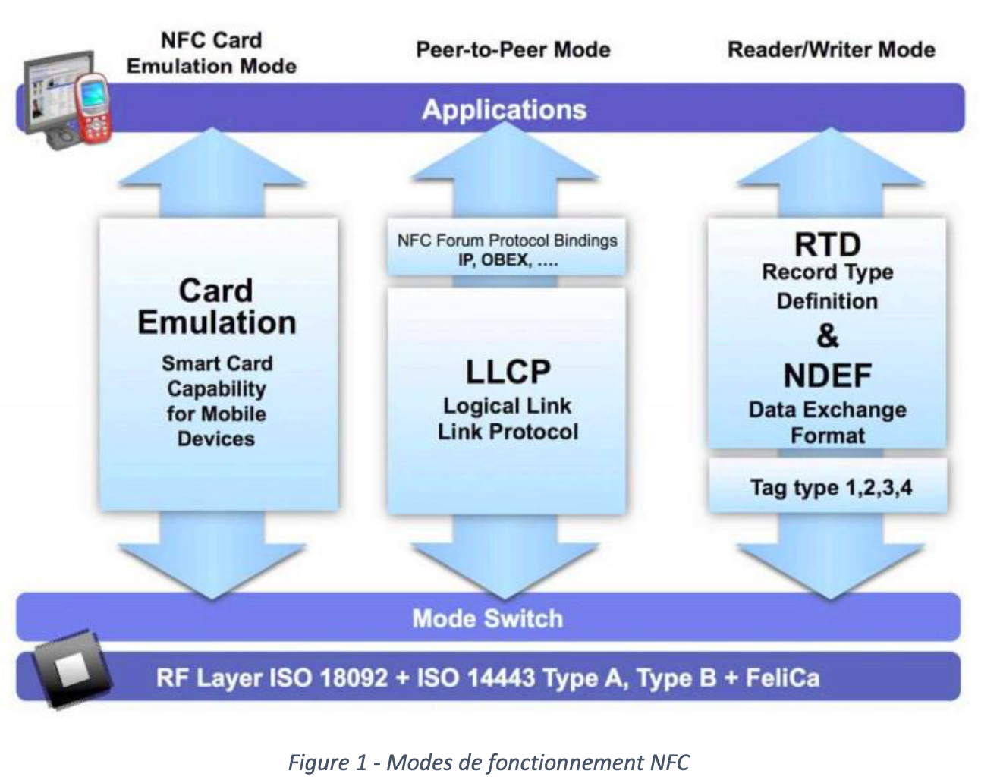
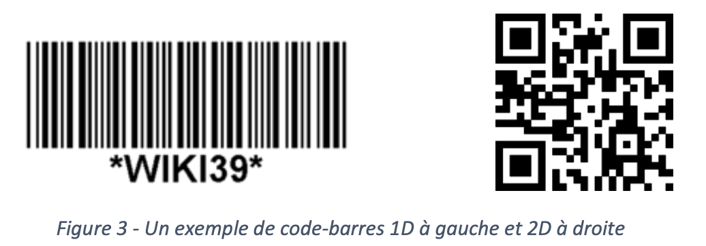

# SYM - Laboratoire 3

Ce travail est constitué de manipulations qui vont vous permettre de vous familiariser avec l’utilisation de données environnementales. Celui-ci est divisé en deux laboratoires : dans cette première partie nous nous intéresserons aux codes-barres et aux balises NFC, la seconde sera consacrée aux capteurs et à la communication Bluetooth Low Energy.

## Motivation

L'un des problèmes récurrents dans le cadre des applications de grande mobilité est de parvenir à se situer relativement à son environnement. Les applications tirant parti de la géolocalisation sont bien connues, mais la notion d'environnement est plus vaste que le simple lieu où l'on se trouve, et de nombreux paramètres environnementaux ne peuvent pas simplement se réduire à une localisation géographique. Parmi ces paramètres citons, sans souci d'exhaustivité :

* Localisation sociale (sphère privée, sphère familiale, sphère professionnelle, sphère publique)
* Localisation indoor (salon, salle de bains, garage, chambre à coucher, ...)
* Météorologie locale
* Période de l'année, du jour, saison
* Type d'activités en cours (assis, marche, en voiture, en train, ...)
* Agenda

Toutes ces informations, et bien d'autres encore, participent à l'environnement au sens large de l'utilisateur. Et il ne faudrait en aucun cas oublier le principal acteur dans cette notion d'environnement, qui est l'utilisateur lui-même ; c'est en effet lui qui définit, dans une large part, l'environnement dans lequel il est plongé à un instant donné.
Une part de la notion d'environnement est "artificielle" ; une géolocalisation par GPS ou triangulation d'antennes, par exemple, est une notion qui dépend de la position de l'utilisateur, et est largement indépendante de l'application ; en revanche, la lecture d'une balise RFID, même si elle est utilisée pour donner aussi une indication de position, est artificielle en ce sens que l'application a été spécifiquement prévue pour tirer parti de la présence de cette balise.
L'objectif de cette manipulation est d'examiner quelques-uns des outils utilisés pour "fabriquer" un environnement spécifique apte à permettre le fonctionnement d'applications particulières.

## Balises NFC

### Introduction à la technologie

NFC (Near Field Communication) est une technologie sans fil autorisant l'échange d'informations entre deux terminaux compatibles à une distance maximale d'environ 4 centimètres . La technologie fonctionne dans une bande de fréquences située vers 13.56 MHz, et permet des transferts de données à un débit compris entre 106 et 424 kbit/s. Contrairement à une technologie comme Bluetooth, il n'y a pas de phase de découverte, ni de pairage préalable entre partenaires de la communication, ce qui permet un temps de mise en fonction (setup time) très court (typiquement 100 ms).

NFC constitue une relation asymétrique, avec un initiateur qui va fournir le champ électrique nécessaire à alimenter une cible qui n'a, quant à elle, pas besoin de source d'énergie indépendante. Il y a trois modes de communication différents définis dans le cadre de NFC (voir Fig. 1) :

* **Peer-to-peer** Dans ce mode, des échanges bidirectionnels peuvent avoir lieu, avec des types de données indifférents. Ce mode de communication peut être fonctionnellement comparé à une communication *Bluetooth* ou *WiFi*. Ce mode de communication est le mode le plus populaire dès lors que l'on intègre la technologie NFC sur des terminaux intelligents (comme des smartphones), car c'est le mode qui permet le mieux de tirer parti de la capacité de traitement du smartphone. La technologie *Android Beam* est basée sur ce mode de fonctionnement.
* **Read/Write** En mode lecture, le périphérique NFC acquiert des données d'une balise externe, généralement passive. Ce mode remplit une fonctionnalité similaire à la lecture d'un code-barres. Certaines balises supportent aussi la fonction d'écriture, qui permet au terminal de stocker des données sur la balise. Les types et la quantité de données que l'on peut stocker sur les balises sont très divers, et les balises elle-même peuvent se présenter sous divers conditionnements (porte-clés, cartes de visite, étiquettes autocollantes, patches souples, ...)
* **Card / Tag emulation** En mode émulation de balise, le terminal NFC se comporte comme une balise passive. Le lecteur ne peut faire la différence entre un terminal en mode émulation et une balise passive.

En mode peer-to-peer, l'initiant et la cible sont tous deux actifs (génèrent donc des champs RF). Dans les autres modes, seul l'initiant génère un champ qui sera utilisé par la cible. Il n'y a aucun chiffrement au niveau liaison dans le cadre de la technologie NFC. Si une application a un besoin spécifique de sécurité, le chiffrement du contenu est à sa charge. NFC est un cas particulier de RFID, avec une portée limitée à quelques centimètres. Dans le cas d'utilisation dans un contexte de balise, le profil NDEF (NFC Data Exchange Format) est particulièrement bien adapté.



### Manipulation

Dans l'optique de la sécurisation d'une application, on aimerait utiliser un porte-clés muni d'une puce NFC en guise de "credential", en conjonction avec un dispositif mobile (smartphone, tablette) capable de lire des balises NFC. Pour autant, on ne désire pas renoncer au traditionnel login/mot de passe. Développer une application dont l'accès est sécurisé par la combinaison d'un mot de passe et d'une balise NFC adéquate.


Condition supplémentaire, on désire que cette identification ait une durée de vie restreinte, et qu'elle implémente un effet de vieillissement. Ainsi, immédiatement après l'authentification, on souhaite que le niveau d'authentification soit maximal, et corresponde par exemple à un score arbitraire de AUTHENTICATE_MAX (disons égal à 10, par exemple). Après un temps à définir, ce niveau va décroître, jusqu'à tomber finalement à zéro. Ceci permettrait dans une hypothétique application d'avoir des objets très sensibles qui sont consultables uniquement immédiatement après une authentification (Required : AUTHENTICATE_MAX) pour prévenir une utilisation après vol du mobile en mode authentifié, alors que certains autres, moins sensibles, peuvent être utilisés pendant une période plus longue après l'authentification (Required : AUTHENTICATE_MEDIUM ou AUTHENTICATE_LOW). Bien évidemment, une nouvelle lecture de la balise NFC remet le niveau d'authentification à son maximum.

On trouvera des exemples d'implémentation de lecture de tags NFC sur le web (par exemple [http://mobile.tutsplus.com/tutorials/android/reading-nfc-tags-with-android/](http://mobile.tutsplus.com/tutorials/android/reading-nfc-tags-with-android/)) en grand nombre, aussi bien pour lire que pour écrire sur un tag NFC. En l’occurrence, on se contentera de lire le tag (au format NDEF !) pour vérifier son authenticité, puis le combiner avec d'éventuelles autres informations pour décider de la validité de l'authentification.

### Détail d’implémentation

Il existe plusieurs familles de tags NFC : NFC-A (ISO 14443-3A), NFC-B (ISO 14443-3B), NFC-F (JIS 6319- 4) et NFC-V (ISO 15693) qui sont des normes ouvertes et par exemple *MifareClassic* ou *MifareUltralight* qui sont des formats propriétaires, pas disponibles sur tous les devices. Le SDK Android permet de travailler à plusieurs niveaux d’abstraction avec les tags NFC, nous allons rester au plus haut niveau possible, nous manipulerons des messages formatés en NDEF uniquement.

Le SDK Android dédié à NFC travaille avec des Intents, il est possible d’ajouter des <intent-filter> dans le manifest afin que notre activité ou notre service soit lancé automatiquement par le système lors de la lecture d’un tag ou alors d’enregistrer notre activité à l’exécution pour qu’elle soit notifiée uniquement lorsqu’elle est visible à l’écran, nous utiliserons la seconde méthode dans ce laboratoire. La Fig. 2 donne un exemple de code pour que notre activité reçoive les événements NFC, vous devrez en plus surcharger la méthode onNewIntent() qui sera appelée pour les tags à proximités.

```java
// called in onResume()
private void setupForegroundDispatch() {
  if(mNfcAdapter == null)
    return;

  final Intent intent = new Intent(this.getApplicationContext(), this.getClass());
  intent.setFlags(Intent.FLAG_ACTIVITY_SINGLE_TOP);

  final PendingIntent pendingIntent =
      PendingIntent.getActivity(this.getApplicationContext(), 0, intent, 0);

  IntentFilter[] filters = new IntentFilter[1];
  String[][] techList = new String[][]{};

  // Notice that this is the same filter as in our manifest.
  filters[0] = new IntentFilter();
  filters[0].addAction(NfcAdapter.ACTION_NDEF_DISCOVERED);
  filters[0].addCategory(Intent.CATEGORY_DEFAULT);
  try {
    filters[0].addDataType("text/plain");
  } catch (IntentFilter.MalformedMimeTypeException e) {
    Log.e(TAG, "MalformedMimeTypeException", e);
  }

  mNfcAdapter.enableForegroundDispatch(this, pendingIntent, filters, techList);
}

// called in onPause()
private void stopForegroundDispatch() {
  if(mNfcAdapter != null)
    mNfcAdapter.disableForegroundDispatch(this);
}
```

### Questions

#### Question 1

Dans la manipulation ci-dessus, les tags NFC utilisés contiennent 4 valeurs textuelles codées en UTF-8 dans un format de message NDEF. Une personne malveillante ayant accès au porte- clés peut aisément copier les valeurs stockées dans celui-ci et les répliquer sur une autre puce NFC.

A partir de l’API Android concernant les tags NFC, pouvez-vous imaginer une autre approche pour rendre plus compliqué le clonage des tags NFC ? Existe-il des limitations ? Voyez-vous d’autres possibilités ?

#### Question 2

Est-ce qu’une solution basée sur la vérification de la présence d’un iBeacon sur l’utilisateur, par exemple sous la forme d’un porte-clés serait préférable ? Veuillez en discuter.

## Codes-barres

La définition proposée par Wikipedia : *« Un code-barres, ou code à barres, est la représentation d'une donnée numérique ou alphanumérique sous forme d'un symbole constitué de barres et d'espaces dont l'épaisseur varie en fonction de la symbologie utilisée et des données ainsi codées. Il existe des milliers de codes-barres différents ; ceux-ci sont destinés à une lecture automatisée par un capteur électronique, le lecteur de code-barres. Pour l'impression des codes-barres, les technologies les plus utilisées sont l'impression laser et le transfert thermique. »*

Il existe de nombreux types de codes-barres différents, mais on peut les classer en 2 catégories principales, les codes unidimensionnels (1D) et les codes bidimensionnels (2D). Les premiers permettent généralement de stocker une courte chaine de caractères alors que les seconds permettent de stocker plus de données. Dans le cas des codes-barres 2D, plus on ajoute d’information, plus le code sera grand et donc moins il sera aisé de le lire.



Les codes-barres 2D de type **code QR** (Quick Response Code, exemple à droite sur la Fig. 3) sont composés de pixels noirs sur un fond blanc carré, l’information est contenue dans l’agencement de ces points noirs, les données sont protégées avec un code correcteur d’erreur de type *Reed-Solomon*. Bien qu’il soit possible de stocker des données brutes, certains types prédéfinis existent et permettent de déclencher une action lors de la lecture, par exemple :

* Ouvrir une URL (Page web, vidéo, position sur une carte, etc.) ;
* Configurer et se connecter à une borne Wi-Fi ;
* Déclencher un appel vers un numéro de téléphone ou envoyer un SMS ;
* Ajouter un contact à son annuaire, etc.

Ce type de code est destiné à une lecture optique sans contact. Le coût de fabrication d'un tel code est pratiquement nul (inférieur à la technologie NFC) ; mais requiert une focalisation optique pour une lecture correcte. Les lecteurs laser à absorption de lumière réfléchie, tels que les lecteurs utilisés dans les caisses enregistreuses de grands magasins, sont actuellement très performants.

Il est possible de déchiffrer un code-barres à l'aide d'un simple capteur photo ; mais cela pose le problème de la focalisation de l'objectif : même si les objectifs "fix-focus" des smartphones d’entrée de gamme sont très tolérants en termes de mise au point, il n'est pas toujours évident de leur faire lire correctement un code-barres, même simple (1D). On se propose dans cette manipulation de mettre en évidence les avantages et inconvénients de l'utilisation d’un smartphone pour déchiffrer ces codes- barres.

Pour contourner l'obstacle, assez considérable, du traitement et du décodage de l'image, nous allons utiliser un logiciel/librairie open source, accessible sur le *Google Play Store*, appelé *Barcode Scanner* et mis au point par l'éditeur *Zxing*. Ce n'est certainement pas le logiciel le plus performant en termes de vitesse et de précision de détection en conditions médiocres, mais il est bien documenté, et il peut être aisément invoqué depuis une application externe grâce à une API basée sur des *Intents* mise à disposition par le développeur :

* [https://github.com/zxing/zxing/wiki/Scanning-Via-Intent](https://github.com/zxing/zxing/wiki/Scanning-Via-Intent)

Une autre librairie encapsule celle-ci, permettant d’éviter à vos utilisateurs de devoir installer une seconde application ou de directement intégrer la lecture de codes-barres directement à vos propres activités. Celle-ci dispose aussi d’une bonne documentation et d’un support régulier :

* [https://github.com/journeyapps/zxing-android-embedded](https://github.com/journeyapps/zxing-android-embedded)

### Manipulation

L'objectif de cette manipulation est simplement d'être en mesure de lire un code-barres uni ou multidimensionnel (par exemple de type code QR), et d'afficher la valeur du code dans une activité que vous aurez définie vous-même. On peut par exemple imaginer que ce code barre remplace le code NFC de la manipulation précédente. Il existe de nombreux sites internet permettant de générer des codes QR sur Internet vous permettant de tester votre solution.

Nous demandons au minimum une utilisation de la librairie *Zxing* avec l’API basée sur des *Intents*. Un bonus vous sera attribué en cas d’intégration complète de la librairie à votre application (vue/fenêtre de capture et décodage du QR-code directement depuis votre activité).

### Questions

#### Question 1

Quelle est la quantité maximale de données pouvant être stockée sur un QR-code ? Veuillez expérimenter, avec le générateur conseillé de codes-barres (QR), de générer différentes tailles de QR-codes. Pensez-vous qu’il est envisageable d’utiliser confortablement des QR- codes complexes (par exemple du contenant >500 caractères de texte ou une vCard très complète) ?

### Question 2

Il existe de très nombreux services sur Internet permettant de générer des QR-codes dynamiques. Veuillez expliquer ce que sont les QR-codes dynamiques. Quels sont les avantages et respectivement les inconvénients à utiliser ceux-ci en comparaison avec des QR-codes statiques. Vous adapterez votre réponse à une utilisation depuis une plateforme mobile.

## Durée

* 6 périodes
* A rendre le dimanche **01.12.2019** à **23h55** au plus tard.

## Rendu/Evaluation

Pour rendre votre code, nous vous demandons de bien vouloir zipper votre projet Android Studio, vous veillerez à bien supprimer les dossiers build (à la racine et dans app/) pour limiter la taille du rendu. En plus, vous remettrez un document **pdf** comportant au minimum les réponses aux questions posées.

Merci de rendre votre travail sur CyberLearn dans un zip unique. N’oubliez pas d’indiquer vos noms dans le code, sur vos réponses et de commenter vos solutions.

**Bonne chance !**
